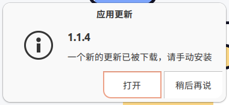

# luck-electron-auto-updater

`luck-electron-auto-updater` is an enhancement of the native `autoUpdater`. While the native `autoUpdater` only supports the Squirrel program on Mac and Windows, this module additionally introduces support for Linux (Ubuntu). It's essential to note that the behavior on Linux differs: it merely notifies users of an update and, after downloading, guides them to open the file, requiring manual installation.

  

> Note: On Linux systems, given that users must install manually, it's permissible not to sign the installation package.

[简体中文](./README-zh_CN.md) | English

## API

The interfaces and events of this module remain consistent with the native `autoUpdater`.

### Events
- error
- checking-for-update
- update-available
- update-not-available
- update-downloaded
- before-quit-for-update

### Methods
- setFeedURL
- getFeedURL
- checkForUpdates
- quitAndInstall

For more details, refer to the [autoUpdater Official Documentation](https://www.electronjs.org/docs/latest/api/auto-updater).

## Lifecycle

The lifecycle and event-triggering sequence of this module are the same as the native component. The only difference is that on Mac and Windows systems, the `quitAndInstall` method will update and exit. In contrast, on Linux, it only opens the location of the downloaded file.

## Usage Example

```
const { app, dialog } = require('electron')
const log = require("electron-log");
const { CustomAutoUpdater } = require('luck-electron-auto-updater');

app.autoUpdater = autoUpdater = new CustomAutoUpdater();
const { domain, freq, appName, channel } = app.appConfig.autoUpdate;

log.info('auto update', domain, freq, appName, channel);

if (!domain) return;

const suffix = ['darwin', 'linux'].includes(process.platform) ? `/RELEASES.json?method=JSON&version=${app.getVersion()}` : '';
const checkUpdateUrl = `${domain}/${appName}/${channel}/${process.platform}/${process.arch}${suffix}`;

log.info('auto update checkUpdateUrl', checkUpdateUrl);

function showUpdateDialog() {
    const dialogOpts = {
        type: 'info',
        buttons: [['darwin', 'win32'].includes(process.platform) ? app.i18n.__('restart') : app.i18n.__('open'), app.i18n.__('later')],
        title: app.i18n.__('app_update_tip'),
        message: app.newRelease,
        detail: app.i18n.__('app_update_tip_detail')
    }

    dialog.showMessageBox(dialogOpts).then((returnValue) => {
        if (returnValue.response === 0) autoUpdater.quitAndInstall()
    })
}

autoUpdater.on('update-available', () => {
    log.log('update-available');
    if (app.newRelease)
        showUpdateDialog();
});

autoUpdater.on('update-downloaded', (event, releaseNotes, releaseName) => {
    log.log('update-downloaded');
    app.newRelease = process.platform === 'win32' ? releaseNotes : releaseName;
    showUpdateDialog();
})

autoUpdater.on('error', (message) => {
    log.error('There was a problem updating the application')
    log.error(message)
});

autoUpdater.setFeedURL({
    url: checkUpdateUrl,
    serverType: 'json',
});

app.whenReady().then(() => {

    // 默认在启用启动时检查一次更新
    setTimeout(() => {
        log.log('auto-update checkForUpdates');
        autoUpdater.checkForUpdates();
    }, 10000);

    // 定时检查更新
    setInterval(() => {
        log.log('auto-update interval checkForUpdates');
        autoUpdater.checkForUpdates()
    }, freq);
});
```

```
 autoUpdate: {
        // 是否启用自动更新
        enable: true,
        // 更新服务地址
        domain: "http://162.1.1.69:9999",
        // 更新服务中的应用名称
        appName: "pcclient",
        //publish server
        updateServer:'http://162.1.1.69:8888',
        // 更新频道id
        channel: "e1ad93770345249aeb962d450314e9ef",
        // app id
        appId: 1,
        // app token
        token: '960221a59f2788404ab848db4519592b',
        // 应用更新检测频率，默认每天提醒一次
        freq: 86400000
    },
```

## Server Response Format

The format of the version list returned by the update server is as follows. Linux and Mac systems share a format, while Windows has its unique format.

```
{
  "releases": [
    {
      "version": "1.1.3",
      "updateTo": {
        "version": "1.1.3",
        "pub_date": "Tue Aug 15 2023 13:45:08 GMT+0800 (CST)",
        "notes": "",
        "name": "1.1.3",
        "url": "http://162.1.1.69:9999/pcclient/e1ad93770345249aeb962d450314e9ef/linux/arm64/luck-pc-client_1.1.3_arm64.deb"
      }
    },
    {
      "version": "1.1.4",
      "updateTo": {
        "version": "1.1.4",
        "pub_date": "Tue Aug 15 2023 13:45:08 GMT+0800 (CST)",
        "notes": "",
        "name": "1.1.4",
        "url": "http://162.1.1.69:9999/pcclient/e1ad93770345249aeb962d450314e9ef/linux/arm64/luck-pc-client_1.1.4_arm64.deb"
      }
    }
  ],
  "currentRelease": "1.1.4"
}
```

Win format：

```
B54F68436459E0DDF06CDDEB96DEDADED6082066 http://162.1.1.69:9999/pcclient/e1ad93770345249aeb962d450314e9ef/win32/arm64/luck-pc-client-arm64-1.1.3-full.nupkg 147072854
```

## Testing

```
npm run test
```